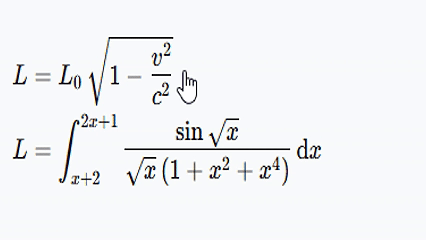
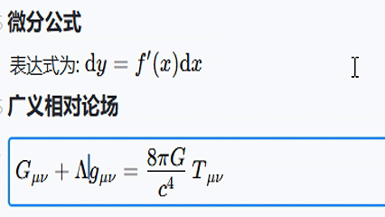
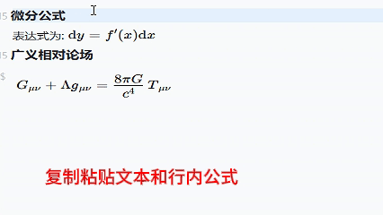
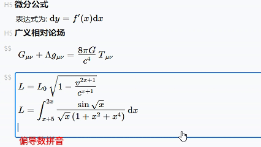
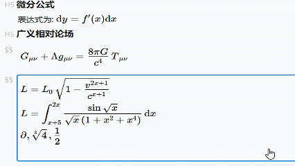
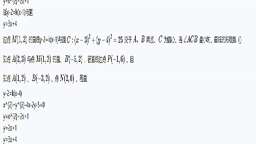
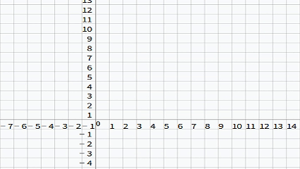
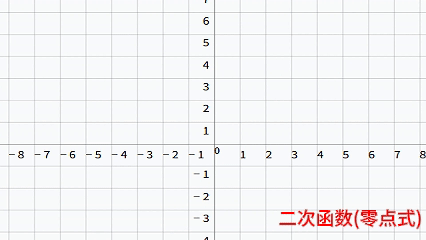
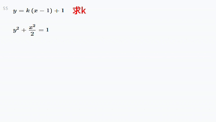

# Mathdown
## Introduction
Mathdown is a lightweight professional tool designed to **solve the industry pain point of "separation between Markdown and formula editing"**. It achieves seamless integration of Markdown text creation and mathematical formula editing, while also featuring formula calculation, convenient graphing functions, and comprehensive content management and retrieval capabilities.

### Core Feature: Seamless Integration of Markdown and Formula Editing
1. **Full Markdown Syntax Support**
It fully supports all standard Markdown syntax and extended text formatting elements (headings, lists, tables, etc.), including complex nested structures, image insertion, hyperlinks, document metadata, footnotes, and document jumps, providing users with a complete and efficient creation experience.

2. **WYSIWYG and User-Friendly Formula Editing**
Breaking the limitations of traditional Markdown tools, it adopts a mixed editing mode that allows users to modify formulas in real time directly within the formula area. Both inline and block-level formulas support cursor positioning for editing with smooth operation, **greatly reducing the learning cost and usage threshold of formula editing**.

   

3. **Unified Cursor Movement System for Integrated Editing**
The entire document uses a unified cursor operation mode to realize content editing and unified selection of Markdown text (headings, paragraphs, lists, tables, hyperlinks, etc.) and formulas. It supports natural mouse selection and keyboard shortcuts, with **powerful content block manipulation capabilities**. Users can quickly navigate to target positions via shortcuts, move the cursor across paragraphs, double-click to select words or formulas, and switch between text and formula editing without changing editing modes. Operations such as editing, modification, deletion, copy and paste are all efficient and convenient.

   
   
   

### Enhanced Features to Boost User Efficiency and Experience
1. **Bidirectional Associative Completion**
   - **LaTeX Pinyin-Associative Completion**: IntelliGent associative completion of LaTeX commands (e.g., Greek letters, operators) specifically designed for formula editing. For example, entering the Pinyin "pian" (the Pinyin for partial derivative) for `\partial` will match the corresponding LaTeX command `\partial`, significantly improving formula editing efficiency.
     
   - **Historical Formula Associative Completion**: It records historical formula content in the user's current document. When entering similar formulas (e.g., `3x^2+2`), the system automatically recommends options such as `3x^2` or `3x^2+2`, helping users reuse content quickly, reduce repetitive input, and improve formula writing efficiency.
     

2. **Intelligent Graphing and Mathematical Visualization**
It provides efficient graphing functions supporting various mathematical graphics:
   - **Automatic Extraction and Graphing from Selected Formulas**: Users can select formulas (e.g., `y=\log x` or `y=2^x`) or data (e.g., `A (1,2)`) in the document, and the system will automatically identify and extract key information to generate corresponding graphs with one click. It supports line charts, broken-line graphs, scatter plots, etc., with adjustable styles to optimize graphing effects.
     
     
   - **Support for Dynamic Interaction and Editing of 2D Graphics**: Users can adjust graph parameters by dragging the mouse to preview effects in real time and generate 2D mathematical graphics. For example, modifying formulas or adjusting coordinate points (e.g., from `(1,0)` to `(10,1)` or from `(0,1)` to `(1,2)`), the system will automatically recognize and update the graph, supporting rapid drawing of standard graphics.
     
It also supports graphing for multi-function range comparison, adding annotations, and other mathematical visualization-related functions.

3. **Formula Calculation and Transformation**
It supports real-time calculation and transformation of formulas during editing, including result solving, formula splitting, combining like terms, formula simplification, etc., providing convenience for students solving problems and teachers preparing lessons.
   
It also supports advanced mathematical content such as matrix operations, equation solving, and calculus to meet higher mathematical calculation needs.

### Efficient Knowledge Management for Organization and Retrieval
1. **Bidirectional Link System**
It supports bidirectional links between documents, allowing users to quickly jump and trace data to build a knowledge network. Documents containing mathematical formulas can be linked to corresponding explanatory notes, and relevant references are automatically displayed during editing to achieve a networked connection of knowledge.

2. **Tag Classification System**
It can automatically add tags to document content (e.g., `#Calculus#`, `#Linear Algebra#`), and users can filter content of different categories through tags to standardize document classification.

3. **Full-Text Retrieval System**
Adopting efficient full-text retrieval technology, it supports searching document content and formulas by keywords, accurately matching symbols, formula structures, and tag information in formulas to quickly locate target content and improve content management efficiency.

## QQ Communication Group
- 635882143@qq.com

## Download
### Windows
- [Github](https://github.com/someoneof/mathdown/releases/download/v2.0.0/Mathdown-2.0.0-win.exe)
- [Tencent Weiyun](https://share.weiyun.com/0Ay7vDaT)
